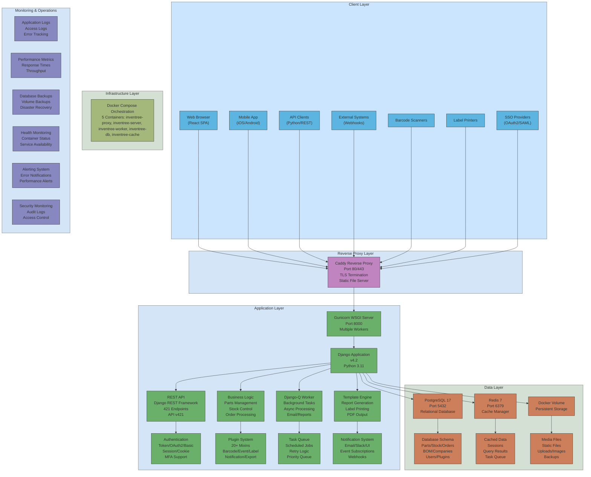

InvenTree - Business Requirements and Technical Architecture Document 

Summary 

InvenTree is an open-source inventory management system designed to provide intuitive parts management and stock control for small to medium enterprises. The system is built on a modern technology stack using Python and Django framework, with a RESTful API architecture that enables both web-based user interfaces and programmatic integrations. InvenTree version 1.1.6 with API version 421 is currently deployed and operational. 

Business Requirements 

Core Business Capabilities 

InvenTree serves as a comprehensive inventory management system with integrated product lifecycle management functionality. The system addresses the fundamental business need of tracking physical inventory, managing manufacturing processes, and maintaining relationships with suppliers and customers throughout the product lifecycle. 

Parts Management 

The parts management capability forms the foundation of the InvenTree system. Organizations can create and maintain detailed records for every component, assembly, and finished product in their inventory. Each part can be organized into hierarchical categories that reflect the business structure and operational needs. Parts support multiple attributes including internal part numbers, descriptions, revision tracking, and custom parameters. The system distinguishes between different part types including component parts that are purchased, assembly parts that are manufactured from other parts, and virtual parts that represent abstract concepts or services. 

Parts can be associated with multiple suppliers through supplier part relationships, enabling businesses to track alternative sources and pricing information. Each part maintains a complete bill of materials that defines the sub-components required for assembly. The system tracks part revisions to maintain historical records of design changes and modifications. Custom parameters can be defined for parts to capture industry-specific or application-specific attributes that extend beyond the standard data model. 

Stock Control and Tracking 

Stock control provides real-time visibility into inventory levels across all storage locations. Stock items represent physical instances of parts and can be tracked individually through serial numbers or managed in bulk quantities. The system maintains a complete history of all stock movements, adjustments, and transactions to ensure full traceability and audit compliance. 

Stock locations are organized in a hierarchical structure that mirrors physical warehouse layouts, allowing businesses to define buildings, rooms, aisles, shelves, and bins as needed. Each stock item is assigned to a specific location, and the system tracks all movements between locations. Stock can be transferred, counted, added, or removed with full transaction logging. The system supports stock expiry tracking for time-sensitive materials and components. 

Stock ownership capabilities allow businesses to track items that belong to customers or are consigned from suppliers. Stock status codes provide flexibility to mark items as available, quarantined, damaged, or in other custom states. The system generates automatic alerts when stock levels fall below defined thresholds, enabling proactive reordering. 

Manufacturing and Build Management 

The manufacturing module enables businesses to plan and execute production activities. Build orders represent the process of creating new parts from existing stock by following a bill of materials. The system tracks build progress through multiple stages from planning through completion. 

Build orders consume stock items according to the bill of materials, with support for both automatic and manual allocation of components. The system can allocate stock from specific locations or allow flexible allocation based on availability. Build outputs represent the finished products created by the build process, which can be serialized for individual tracking or created in bulk quantities. 

The system supports external manufacturing scenarios where build orders are sent to contract manufacturers. Build orders can be linked to sales orders to support make-to-order production strategies. Test results can be recorded against build outputs to document quality control and acceptance testing activities. 

Purchasing and Supplier Management 

The purchasing module manages the procurement process from supplier selection through goods receipt. Supplier companies are maintained in the system with contact information, payment terms, and performance history. Supplier parts link internal parts to specific supplier catalog numbers and pricing information. 

Purchase orders formalize the procurement process with line items, quantities, pricing, and delivery schedules. The system tracks purchase order status through stages including pending, placed, received, and completed. Partial receipts are supported, allowing businesses to receive portions of an order as they arrive. Received items are automatically added to stock at specified locations. 

Supplier price breaks enable volume-based pricing structures where unit costs decrease at defined quantity thresholds. The system can track multiple suppliers for each part, supporting competitive sourcing and supply chain resilience. Purchase order history provides visibility into past procurement activities and spending patterns. 

Sales and Customer Management 

The sales module manages customer relationships and order fulfillment. Customer companies are maintained with shipping addresses, payment terms, and order history. Sales orders capture customer requirements with line items, quantities, pricing, and delivery commitments. 

Sales order allocation links specific stock items to customer orders, reserving inventory for fulfillment. The system supports partial allocations and backorders when stock is insufficient to fulfill the complete order. Shipments group allocated items for delivery, with tracking numbers and shipping dates recorded. 

Return orders handle the reverse logistics process when customers return products. The system tracks return reasons, disposition decisions, and restocking activities. Sales order history provides complete visibility into customer purchasing patterns and fulfillment performance. 

Reporting and Documentation 

The reporting system generates customized documents using template-based rendering. Report templates can be created for purchase orders, sales orders, build orders, packing lists, and other business documents. Label templates support barcode labels, part labels, location labels, and other identification needs. 

Templates are created using HTML and CSS with access to dynamic data from the InvenTree database. The system provides context variables and helper functions to simplify template development. Reports can be generated in PDF format for printing or electronic distribution. The template system supports conditional logic, loops, and formatting to create sophisticated documents. 

Barcode Integration 

Barcode capabilities streamline data entry and improve accuracy throughout the system. InvenTree supports internal barcode formats that encode database object identifiers for parts, stock items, and locations. External barcode formats from suppliers like DigiKey, Mouser, LCSC, and TME can be scanned and automatically matched to parts and purchase orders. 

Barcode scanning is integrated into receiving workflows, stock movements, build allocation, and sales order picking. The system maintains a history of all barcode scans for audit purposes. Custom barcode plugins can be developed to support additional barcode formats and integration scenarios. 

User Management and Security 

User management provides role-based access control to secure sensitive data and operations. User accounts can be assigned to groups that define permissions for viewing, creating, modifying, and deleting different types of data. The system supports single sign-on integration with external identity providers using OAuth2 and SAML protocols. 

Multi-factor authentication adds an additional security layer for user logins. Email notifications keep users informed of important events and required actions. The system tracks user activity for audit logging and compliance purposes. User preferences allow customization of language, theme, and interface settings. 

Plugin Architecture and Extensibility 

InvenTree provides a comprehensive plugin system that allows businesses to extend core functionality without modifying the base application code. Plugins can integrate with various aspects of the system including barcode scanning, event handling, data export, label printing, notifications, currency exchange, and supplier integration. 

The plugin architecture uses a mixin-based design where plugins implement specific interfaces to provide functionality. Action plugins add custom operations to the user interface. API plugins expose custom endpoints for external integrations. Barcode plugins decode proprietary barcode formats. Event plugins respond to system events like part creation or stock movements. Label printing plugins integrate with physical label printers and printing services. 

Notification plugins deliver alerts through channels like email, Slack, and in-application messages. Currency exchange plugins provide real-time exchange rates for multi-currency pricing. Schedule plugins execute recurring tasks on defined intervals. Validation plugins enforce custom business rules and data quality checks. The plugin system supports configuration settings, background task execution, and database access. 

Technical Architecture 

Deployment Architecture 

InvenTree is deployed using a containerized architecture based on Docker Compose orchestration. The deployment consists of five interconnected services that work together to provide the complete application functionality. This architecture provides isolation, scalability, and simplified deployment across different environments. 

The inventree-db service runs PostgreSQL version 17 as the relational database backend. PostgreSQL stores all application data including parts, stock items, orders, users, and configuration settings. The database service exposes port 5432 for direct database access when needed for backup, reporting, or administrative tasks. Database data persisted to a Docker volume to ensure durability across container restarts. 

The inventree-cache service runs Redis version 7 as the caching layer. Redis provides high-performance caching for frequently accessed data, session storage, and message queuing for background tasks. The cache service exposes port 6379 for connections from the application server and worker processes. Caching significantly improves application response times by reducing database queries for common operations. 

The inventree-server service runs the main Django application using Gunicorn as the WSGI HTTP server. Gunicorn is configured with multiple worker processes to handle concurrent requests efficiently. The server processes HTTP requests from users and API clients, executes business logic, queries the database, and returns responses. The server listens on port 8000 internally within the Docker network. 

The inventree-worker service runs Django-Q as the background task processor. Django-Q handles asynchronous operations that should not block user requests, including sending emails, generating reports, processing bulk imports, and executing scheduled tasks. The worker service connects to the same database and cache as the server to coordinate task execution. 

The inventree-proxy service runs Caddy as the reverse proxy and static file server. Caddy receives incoming HTTP and HTTPS requests on ports 80 and 443, serves static files like JavaScript, CSS, and images directly, and proxies dynamic requests to the Gunicorn application server. Caddy handles TLS certificate management, request routing, and load balancing. 

All services share a common external volume for persistent data storage. Services are configured with restart policies to automatically recover from failures. Dependencies between services ensure proper startup ordering, with the database and cache starting before the application server and worker. 

Application Framework and Technology Stack 

InvenTree is built on the Django web framework version 4.2, which provides a robust foundation for database modeling, request handling, authentication, and administration. Django follows the model-view-template architectural pattern, separating data models, business logic, and presentation layers. 

The application uses Django REST Framework to implement the RESTful API. Django REST Framework provides serialization, authentication, permissions, pagination, filtering, and API documentation capabilities. The API follows REST principles with resource-based URLs, standard HTTP methods, and JSON data formats. 

The frontend user interface is implemented using a combination of server-rendered templates and a modern React-based single-page application. The React frontend communicates with the backend exclusively through the REST API, providing a responsive and interactive user experience. The frontend uses modern JavaScript libraries and frameworks for state management, routing, and component composition. 

Python version 3.11 serves as the runtime environment, providing performance improvements and modern language features. The application uses numerous Python libraries for specific functionality including Pillow for image processing, ReportLab for PDF generation, django-q for task queuing, and requests for HTTP client operations. 

Database Schema and Data Model 

The database schema implements a comprehensive data model that captures all aspects of inventory management, manufacturing, and order processing. The schema uses PostgreSQL-specific features including JSON fields, full-text search, and advanced indexing for optimal performance. 

The part table serves as the central entity, storing part definitions with fields for internal part number, name, description, category, revision, and various flags indicating part characteristics. Parts are organized into hierarchical categories through the part_category table. The part_parameter table stores custom attributes for parts using a key-value structure. 

The stock_item table represents physical inventory with fields for part reference, quantity, location, serial number, batch code, and status. Stock locations are organized hierarchically through the stock_location table. The stock_item_tracking table maintains a complete audit trail of all stock movements and adjustments. 

The bill_of_materials table defines the components required to build each assembly part. BOM items specify the sub-part, quantity, reference designators, and optional/inherited flags. The system supports multi-level BOMs where sub-assemblies have their own BOMs. 

The build_order table manages manufacturing activities with fields for part being built, quantity, status, and completion date. The build_item table tracks component allocation to builds. The build_line table records build outputs including serial numbers and completion status. 

The purchase_order table captures procurement activities with supplier reference, status, and delivery information. The purchase_order_line_item table defines the parts and quantities being purchased. The sales_order table manages customer orders with similar structure. 

The company table stores both suppliers and customers with a type flag distinguishing between them. The supplier_part table links parts to supplier catalog numbers and pricing. The manufacturer_part table tracks original equipment manufacturer information. 

User authentication and authorization use Django’s built-in user and group tables extended with custom profile information. The plugin_config table stores plugin settings and state. The background_task table queues asynchronous operations for worker processing. 

API Architecture and Endpoints 

The InvenTree API provides comprehensive programmatic access to all system functionality through 421 distinct endpoints organized into logical categories. The API implements RESTful principles with resource-based URLs, standard HTTP methods for CRUD operations, and consistent JSON response formats. 

Authentication supports multiple mechanisms including token-based authentication, HTTP basic authentication, session-based cookie authentication, and OAuth2 for third-party integrations. API clients obtain authentication tokens through the login endpoint and include tokens in subsequent requests using the Authorization header. 

The part endpoints provide operations for creating, retrieving, updating, and deleting parts. Endpoints support filtering by category, supplier, manufacturer, and various part attributes. The API returns paginated results for list operations with configurable page sizes. Part detail endpoints include related data like parameters, stock levels, and BOM information. 

The stock endpoints manage inventory operations including creating stock items, transferring between locations, adjusting quantities, and recording test results. Stock tracking endpoints return complete movement history for audit purposes. Stock location endpoints support hierarchical location management with parent-child relationships. 

The build endpoints control manufacturing workflows including creating build orders, allocating components, recording build outputs, and completing builds. Build allocation endpoints support both automatic allocation based on availability and manual allocation of specific stock items. 

The purchase order endpoints manage procurement from creation through receipt. Endpoints support adding line items, updating quantities and pricing, placing orders with suppliers, and receiving items into stock. Purchase order line endpoints track receipt status and link to stock items created upon receipt. 

The sales order endpoints handle customer order processing including order creation, line item management, stock allocation, and shipment creation. Sales order allocation endpoints reserve specific stock items for customer orders. Shipment endpoints track delivery information and completion status. 

The company endpoints manage supplier and customer records with contact information and relationships. Supplier part endpoints link internal parts to supplier catalogs with pricing and lead time information. Manufacturer part endpoints track OEM part numbers and specifications. 

The barcode endpoints decode scanned barcodes and return matching database objects. The system supports both internal barcode formats that encode object identifiers and external formats from major suppliers. Barcode scan endpoints record scan events for audit purposes. 

The plugin endpoints list available plugins, retrieve plugin configuration, and invoke plugin actions. Plugin settings endpoints allow runtime configuration of plugin behavior. The API provides endpoints for each plugin that implements API integration. 

The admin endpoints provide system administration capabilities including user management, group permissions, global settings, and background task monitoring. Settings endpoints retrieve and update configuration values organized by category. Background task endpoints show queued and completed tasks with status and error information. 

The notification endpoints deliver alerts to users through configured channels. Users can subscribe to specific event types and configure delivery preferences. Notification history endpoints show past notifications and read status. 

The report and label endpoints generate documents from templates. Endpoints accept template identifiers and object references, render the template with current data, and return PDF output. Template management endpoints support uploading, editing, and testing templates. 

The machine endpoints integrate with physical equipment like label printers. Machine configuration endpoints define connection parameters and capabilities. Machine status endpoints monitor connectivity and operational state. 

All API endpoints support standard HTTP status codes to indicate success or failure. Error responses include detailed messages and field-level validation errors. The API implements rate limiting to prevent abuse and ensure fair resource allocation. API versioning uses URL path versioning to maintain backward compatibility as the API evolves. 

Background Processing and Task Queue 

Background task processing uses Django-Q to execute operations asynchronously without blocking user requests. The task queue architecture separates the web server processes that handle HTTP requests from worker processes that execute long-running operations. 

Tasks are submitted to the queue by application code when operations should execute asynchronously. The Django-Q scheduler monitors the queue and assigns tasks to available worker processes. Workers execute tasks and update status in the database. Failed tasks can be automatically retried with configurable retry policies. 

Common background tasks include sending email notifications, generating reports and labels, processing bulk data imports, executing scheduled maintenance operations, and synchronizing with external systems through plugins. The task system supports task prioritization, scheduling for future execution, and recurring tasks on defined intervals. 

Task monitoring endpoints provide visibility into queue depth, worker utilization, task completion rates, and error rates. Administrators can view task history, retry failed tasks, and cancel pending tasks through the admin interface. 

Security Architecture 

Security is implemented through multiple layers including authentication, authorization, data encryption, and audit logging. User authentication verifies identity through username and password credentials, with support for external identity providers through single sign-on protocols. 

Authorization uses Django’s permission system to control access to different operations and data types. Permissions are assigned to groups, and users are added to groups to inherit permissions. The system defines granular permissions for viewing, adding, changing, and deleting each data type. 

Data encryption protects sensitive information both in transit and at rest. HTTPS encryption using TLS certificates secures all communication between clients and servers. Database encryption can be enabled to protect data at rest. Sensitive configuration values like API keys and passwords are stored encrypted. 

Audit logging records all significant operations including data modifications, user logins, permission changes, and administrative actions. Audit logs capture the user, timestamp, operation type, and affected objects. Logs are retained for compliance and forensic analysis. 

The system implements protection against common web vulnerabilities including SQL injection, cross-site scripting, cross-site request forgery, and clickjacking. Django’s built-in security features provide automatic escaping, CSRF tokens, and security headers. 

Integration Capabilities 

InvenTree provides multiple integration mechanisms to connect with external systems and workflows. The REST API enables custom applications to interact with InvenTree programmatically. The Python client library simplifies API integration for Python-based applications. 

Webhook notifications deliver real-time event notifications to external systems when significant events occur. Webhooks can trigger automation workflows in tools like Zapier, n8n, or custom applications. Event types include part creation, stock movements, order status changes, and build completion. 

The plugin system allows deep integration with external services and equipment. Plugins can implement custom authentication providers, integrate with ERP systems, connect to label printers and barcode scanners, and extend the user interface with custom pages and actions. 

Data import and export capabilities support bulk operations and system integration. The system can import parts, BOMs, and stock data from CSV and Excel files. Export plugins generate data extracts in various formats for analysis and reporting in external tools. 

Performance and Scalability 

Performance optimization uses multiple strategies including database indexing, query optimization, caching, and asynchronous processing. Database indexes on frequently queried fields accelerate search and filter operations. Query optimization minimizes database round trips through selective prefetching and aggregation. 

Redis caching stores frequently accessed data in memory to reduce database load. Cache invalidation ensures users see current data after modifications. Session data is stored in Redis for fast access and to support horizontal scaling. 

The containerized architecture supports horizontal scaling by running multiple application server and worker containers behind a load balancer. Database connection pooling efficiently manages database connections across multiple processes. Static file serving through the Caddy proxy reduces load on application servers. 

Monitoring and Operations 

System monitoring tracks application health, performance metrics, and error rates. The admin interface provides dashboards showing system status, background task queues, and recent errors. Error logging captures exceptions with full stack traces for debugging. 

Database backups are essential for disaster recovery and business continuity. The PostgreSQL database can be backed up using standard tools like pg_dump. Backup automation ensures regular backups are created and stored securely. Backup restoration procedures should be tested regularly. 

Log aggregation collects logs from all containers for centralized analysis. Logs include application logs, web server access logs, database logs, and system logs. Log retention policies balance storage costs with compliance requirements. 

Performance monitoring tracks response times, throughput, error rates, and resource utilization. Metrics can be exported to monitoring systems like Prometheus and Grafana for visualization and alerting. Alerts notify administrators of performance degradation or system failures. 

Configuration Management 

System configuration is managed through environment variables, database settings, and configuration files. Environment variables control deployment-specific settings like database connection strings, cache URLs, and secret keys. The .env file stores environment variables for Docker Compose deployments. 

Database settings store user-configurable options that can be modified through the admin interface without redeploying containers. Settings are organized into categories including server configuration, login settings, barcode settings, and plugin settings. Settings changes take effect immediately without requiring restarts. 

Configuration files define application behavior including URL routing, middleware configuration, and installed applications. Configuration files are part of the application code and are version controlled. Changes to configuration files require application redeployment. 

Data Persistence and Storage 

Data persistence uses Docker volumes to store database files, uploaded media files, and static files outside of containers. Volumes ensure data survives container restarts and updates. The external volume is shared across all containers that need access to persistent data. 

Media files include uploaded images, documents, and attachments. Media files are stored in the file system with references in the database. The system generates thumbnails for images to improve performance when displaying lists. 

Static files include JavaScript, CSS, images, and fonts that make up the user interface. Static files are collected from the application code and served directly by the Caddy proxy for optimal performance. Static file versioning ensures browsers load updated files after deployments. 

Backup strategies should include both database backups and volume backups to ensure complete data protection. Database backups capture structured data while volume backups preserve uploaded files and media. Backup testing verifies that backups can be successfully restored. 

Development and Deployment Workflow 

Development follows standard practices including version control, code review, automated testing, and continuous integration. The source code is hosted on GitHub with public access for community contributions. Development uses feature branches that are merged to the main branch after review and testing. 

Automated testing includes unit tests, integration tests, and API tests that verify functionality and prevent regressions. Tests are executed automatically on every commit using continuous integration services. Test coverage metrics track the percentage of code covered by tests. 

Deployment uses Docker containers to ensure consistency across development, testing, and production environments. Container images are built from the source code and published to container registries. Deployments pull the latest images and restart containers with updated code. 

Database migrations handle schema changes as the application evolves. Django’s migration system generates migration files that describe schema changes. Migrations are applied automatically during deployment to update the database schema to match the application code. 

Version management uses semantic versioning to communicate the scope of changes in each release. Major versions indicate breaking changes, minor versions add new features, and patch versions fix bugs. Release notes document changes and provide upgrade instructions. 